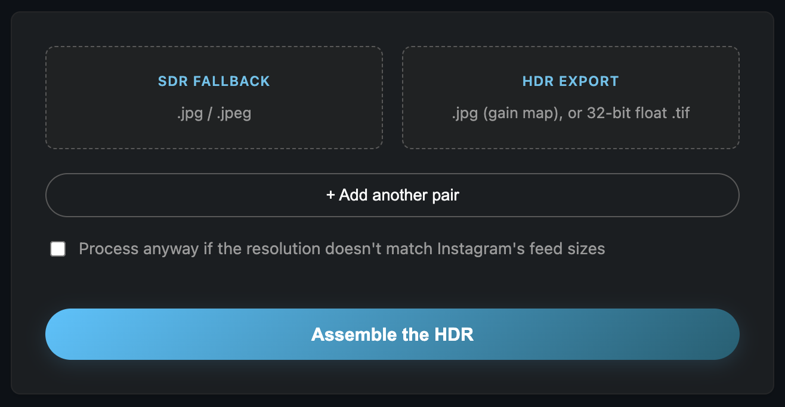
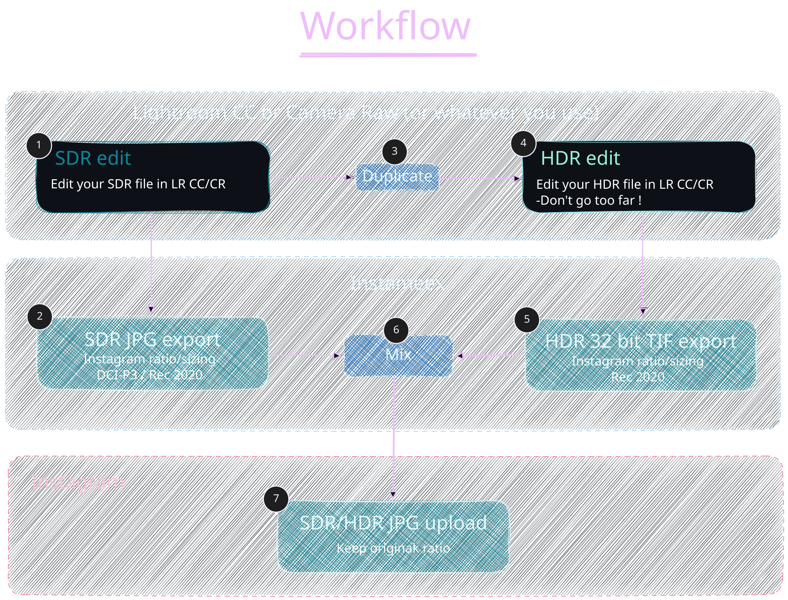

<div align="center">
  
</div>
<p/>
<div align="center">
<p>Mix your SDR and HDR exports into an Instagram-ready HDR photo.</p>
</div>
</p>
<div align="center">
  
</div>


> [!NOTE]
> ⚠️ _This is an heavily vibe-coded proof of concept — **do not expose it to the internet** — use it at your own risk._
>  _Github repo is a mirror of https://git.djeex.fr/Djeex/instameex. You'll find full package, history and release note there._

# Instameex

A small web front end for assembling Instagram-compatible HDR JPEGs (gain
map) from an SDR export and an HDR export out of Lightroom or Camera Raw.

Check the online version : [Instameex-web](https://instameex.djeex.fr/)

The gain-map assembly logic ([src/script/app/assembler.py](src/script/app/assembler.py)) is
adapted from [kostis-kounadis/instagram-hdr-assembler](https://github.com/kostis-kounadis/instagram-hdr-assembler),
itself based on the reverse-engineering work of
[karachungen/instagram-hdr-converter](https://github.com/karachungen/instagram-hdr-converter).
Original MIT license kept in [LICENSE](LICENSE). 

## Contents

- [Why?](#why)
- [How it works](#how-it-works)
- [Running locally, without Docker](#running-locally-without-docker)
- [Running with Docker](#running-with-docker)
- [Running this on the open internet](#running-this-on-the-open-internet)

## Why ?

Nothing is more frustrating than Instagram's HDR handling. It compresses and destroys gain maps, and the slightest change in aspect ratio or size simply strips HDR out entirely. As for Lightroom, its "SDR preview" system is frankly unacceptable, it makes it impossible to get consistent results. Until now, posting on Instagram meant choosing between decent SDR with broken HDR, or the other way around.

Why not simply edit your SDR file to perfection on one side, your HDR file on the other, and then recalculate a gain map from those two perfect files?
A few pioneers have already gone down that road, notably with an [Adobe Lightroom Classic](https://github.com/karachungen/lightroom-plugin-export-hdr) plugin. Judge me if you want, but I only use Lightroom CC, which does not support plugins.

I drew inspiration from a [fork of the original project](https://github.com/kostis-kounadis/instagram-hdr-assembler), the one that eventually became the LrC plugin, to build a frontend that can be easily deployed with Docker. Let's be honest: it was also a great excuse to put my Claude Code subscription to the test. And I have to say, watching it spin up its own environments, run end-to-end tests, self-correct its code, and write detailed summaries is genuinely impressive. I still reviewed everything myself, don't worry. I also learned a great deal about HDR fundamentals, gain maps, HLG/PQ tone curves, color spaces, and more.

In short, here is what my workflow now looks like for posting on Instagram:



## How it works

1. Upload an SDR file (`.jpg`/`.jpeg`) and an HDR file: either a gain-map
   JPEG (`.jpg`/`.jpeg`) or Lightroom's 32-bit float linear HDR TIFF
   export (`.tif`/`.tiff`).
2. Both files must have identical dimensions and match one of Instagram's
   feed resolutions exactly: `1080x1080` (1:1), `1080x1350` (4:5), or
   `1080x566` (1.91:1).
3. The real HDR pixel data is obtained from the HDR file: decoded back
   out of a gain-map JPEG (`ultrahdr_app`, undoing its own embedded base
   image and gain map), or read directly from a linear TIFF and given
   HLG's system-gamma OOTF so it's on the same display-referred scale a
   gain-map JPEG's HDR intent would be. A gain map is only correct
   against the exact base it was computed from, and that's rarely the
   SDR file you upload, so reusing an existing one as-is would quietly
   reconstruct the wrong HDR look. Your SDR file is cleaned up and
   re-encoded at 4:2:0 chroma subsampling (Pillow), then a fresh gain map
   is computed against it and packaged into the final UltraHDR JPEG
   (`ultrahdr_app`). The output's visible image is exactly your SDR file;
   only the gain map is recomputed. The TIFF route skips the gain-map
   JPEG's 8-bit-in-8-bit precision ceiling, giving a more accurate result.
4. The validation report is shown on the result page, including the
   "GainMapMin is negative" warning when present, with a download link
   for the finished JPEG.

Uploads and results don't stick around: SDR/HDR originals are deleted
right after conversion, the result a few seconds after you leave the
result page (heartbeat + background reaper), and `jobs/` is wiped on every
app startup.


## Running locally, without Docker

```bash
pip install -r requirements.txt
# also install exiftool and compile libultrahdr, see docker/Dockerfile
# for the exact packages and commands (validated on Alpine)
PORT=5050 python3 main.py   # PORT is optional, defaults to 5000
```

## Running with Docker

```bash
docker compose -f docker/compose.yaml up -d --build
```

Opens on `http://<host>:5050` (port 5000 collides with AirPlay Receiver on
macOS, hence 5050 by default; change it in `docker/compose.yaml` if
needed).

## Running this on the open internet

Don't do it.